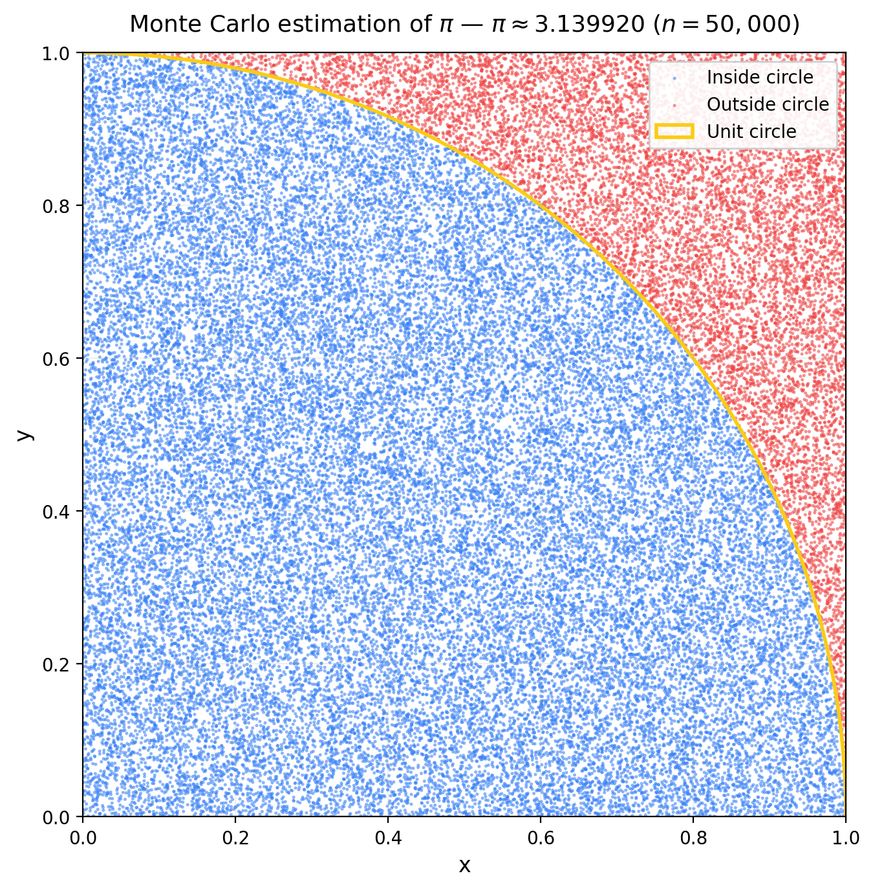
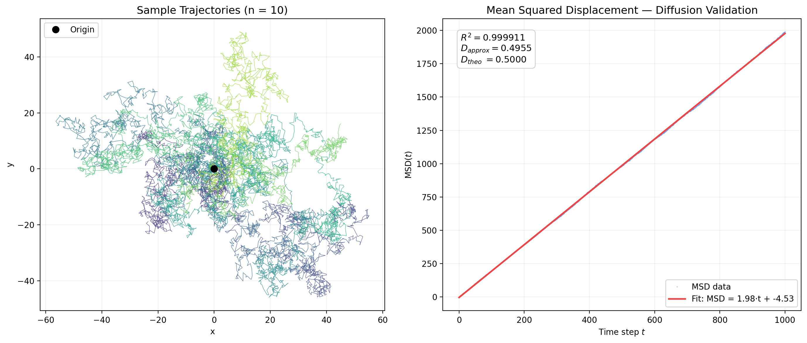
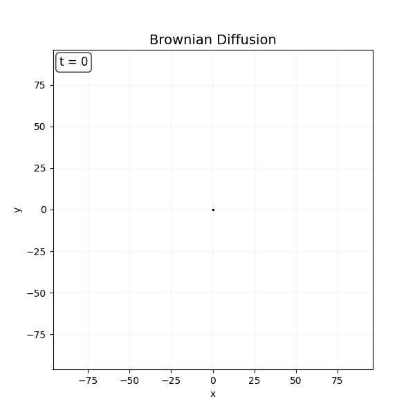
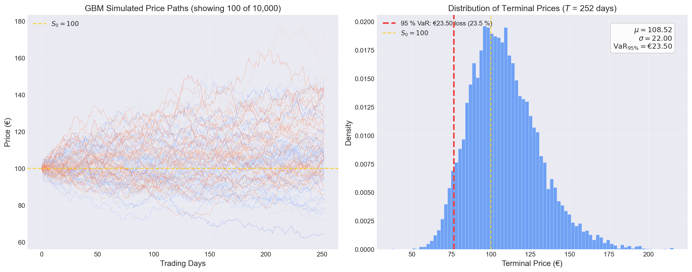
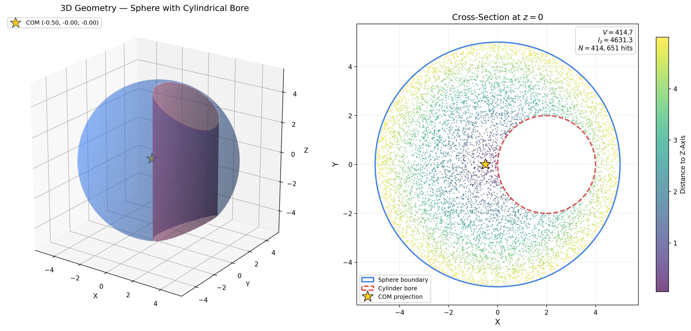
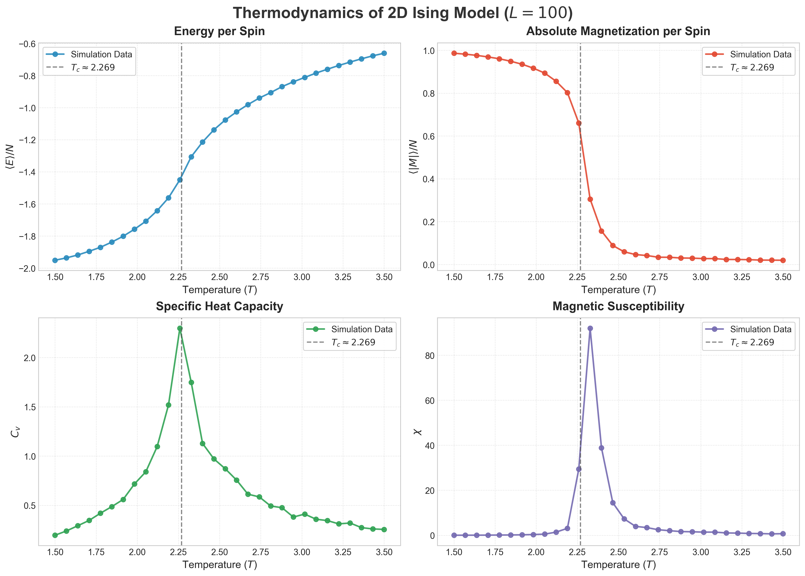
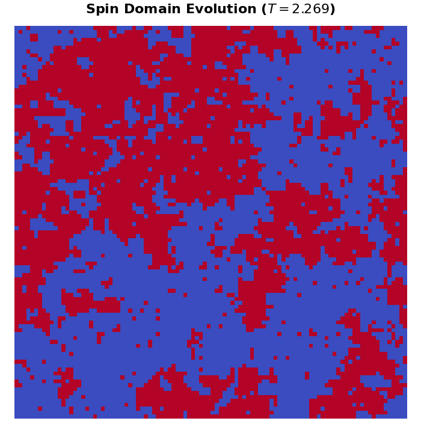

# Monte Carlo Simulations 🎲

A portfolio of **Monte Carlo simulations** written in Python, showcasing numerical methods, stochastic modelling, and scientific visualisation.  
Built with a focus on **vectorised NumPy computation**, **clean modular code**, and **publication-quality plots**.

---

## Modules

| # | Module | Topic | Status |
|---|--------|-------|--------|
| 1 | [`01_pi_approximation`](01_pi_approximation/) | Estimating π via random sampling | ✅ Done |
| 2 | [`02_random_walk`](02_random_walk/) | 2D Brownian motion & diffusion | ✅ Done |
| 3 | [`03_stock_gbm`](03_stock_gbm/) | Stock simulation (GBM) & Value at Risk | ✅ Done |
| 4 | [`04_nd_integration`](04_nd_integration/) | 3D Volume & Inertia calculation | ✅ Done |
| 5 | [`05_ising_model`](05_ising_model/) | 2D Ising model (Metropolis algorithm) | ✅ Done |

---

## 01 — Monte Carlo Estimation of π

The classic Monte Carlo experiment: sample random points in the unit square and check whether they fall inside the quarter unit circle.

$$\pi \approx 4 \cdot \frac{\text{points inside circle}}{\text{total points}}$$

### Result (n = 50,000)

<p align="center">
  
</p>

### Key Design Decisions

- **Vectorised computation** — all coordinate generation and distance checks use NumPy array operations, making the simulation ~50–100× faster than a Python loop.
- **Separation of concerns** — `calculate_pi()` returns raw data; `plot_pi_approximation()` handles visualisation. Both can be used independently.
- **Reproducibility** — a fixed RNG seed (`numpy.random.default_rng(42)`) ensures deterministic results.

---

## 02 — 2D Random Walk & Diffusion Validation

Simulates **10,000 Brownian particles** over 1,000 time steps using fully vectorised Gaussian random walks.  The Mean Squared Displacement (MSD) is computed and fitted to validate the theoretical diffusion law $\text{MSD}(t) = 4Dt$.

### Static Analysis

<p align="center">
  
</p>

### Diffusion Animation

<p align="center">
  
</p>

### Key Design Decisions

- **Zero loops** — all 10,000 × 1,000 steps are drawn as a single `np.random.normal` call (shape `(N, M, 2)`) and accumulated via `np.cumsum`. The 160 MB trajectory array is computed in under a second.
- **Diffusion proof** — linear regression on MSD yields $D_{approx} \approx 0.4955$ vs. $D_{theo} = 0.5000$ with $R^2 = 0.9999$, confirming correct Brownian dynamics.
- **Animation as GIF** — saved via Pillow for direct embedding in this README.

---

## 03 — Stock Price Simulation & Value at Risk

Models **10,000 stock price paths** over 252 trading days using Geometric Brownian Motion (GBM) and computes the **95 % Value at Risk** from the terminal price distribution.

$$S(t + \Delta t) = S(t) \cdot \exp\!\Bigl[\bigl(\mu - \tfrac{\sigma^2}{2}\bigr)\Delta t + \sigma\,\sqrt{\Delta t}\;Z\Bigr]$$

### Analysis

<p align="center">
  
</p>

### Key Design Decisions

- **Full vectorisation** — all 10,000 × 252 random shocks are drawn in a single `rng.standard_normal((M, N))` call.  Log-returns are accumulated via `np.cumsum` and exponentiated — zero Python loops.
- **Quantitative finance** — implements the exact-solution GBM discretisation and percentile-based VaR, standard tools in risk management.
- **Portfolio ready** — clean parameter block, modular functions, and publication-quality two-panel figure.

---

## 04 — 3D Integration: Volume & Moment of Inertia

Evaluates the volume, center of mass, and moment of inertia of a complex 3D body (a sphere with an off-center cylindrical hole) using **1,000,000** Monte Carlo sample points.

### 3D Visualization

<p align="center">
  
</p>

### Key Design Decisions

- **Hit-or-miss parallelization** — the bounding box coordinates are generated as a `(3, N)` matrix. Complex geometry intersections are handled entirely through logical NumPy masks (e.g. `in_sphere & out_cylinder`), processing 1 million points in milliseconds.
- **Performance-aware visualization** — to avoid crashing Matplotlib, the script automatically downsamples the 3D scatter plot (e.g., plotting every 500th point) while retaining the full shape. Points are color-coded using `viridis` by their distance to the z-axis to visualize the moment of inertia density.

---

## 05 — 2D Ising Model Phase Transition

Simulates the **2D Ising model** of ferromagnetism using the **Metropolis-Hastings algorithm**. Computes macroscopic thermodynamic observables (Energy, Magnetization, Specific Heat, Susceptibility) across a temperature sweep to observe the phase transition.

### Thermodynamic Phase Transition ($L=100$)

<p align="center">
  
</p>

### Spin Domain Dynamics ($T \approx T_c$)

<p align="center">
  
</p>

### Key Design Decisions

- **Checkerboard Vectorization** — MCMC algorithms are inherently sequential and hard to vectorize. By dividing the square lattice into two independent checkerboard subgrids, the code updates half the grid simultaneously without violating detailed balance.
- **Thermodynamic Observables** — Calculates $C_v$ and $\chi$ via the fluctuation-dissipation theorem (variance of energy and magnetization over time) to precisely locate the phase transition near $T_c \approx 2.269$.
- **High-Quality Plotting** — Uses `seaborn` aesthetics for clear, publication-ready multi-panel plots.

---

## Quick Start

```bash
# Clone the repository
git clone https://github.com/calvinkaya/data-analysis-projects.git
cd data-analysis-projects

# Install dependencies
pip install numpy matplotlib

# Run individual modules
python 01_pi_approximation/pi_monte_carlo.py
python 02_random_walk/random_walk.py
python 03_stock_gbm/stock_gbm.py
python 04_nd_integration/nd_integration.py
python 05_ising_model/ising_model.py
```

---

## Tech Stack

| Tool | Purpose |
|------|---------|
| **Python 3.12+** | Core language |
| **NumPy** | Vectorised numerical computation |
| **Matplotlib** | Scientific plotting, animation & visualisation |

---

## License

MIT License

Copyright (c) 2026 calvinkaya

Permission is hereby granted, free of charge, to any person obtaining a copy
of this software and associated documentation files (the "Software"), to deal
in the Software without restriction, including without limitation the rights
to use, copy, modify, merge, publish, distribute, sublicense, and/or sell
copies of the Software, and to permit persons to whom the Software is
furnished to do so, subject to the following conditions:

The above copyright notice and this permission notice shall be included in all
copies or substantial portions of the Software.

THE SOFTWARE IS PROVIDED "AS IS", WITHOUT WARRANTY OF ANY KIND, EXPRESS OR
IMPLIED, INCLUDING BUT NOT LIMITED TO THE WARRANTIES OF MERCHANTABILITY,
FITNESS FOR A PARTICULAR PURPOSE AND NONINFRINGEMENT. IN NO EVENT SHALL THE
AUTHORS OR COPYRIGHT HOLDERS BE LIABLE FOR ANY CLAIM, DAMAGES OR OTHER
LIABILITY, WHETHER IN AN ACTION OF CONTRACT, TORT OR OTHERWISE, ARISING FROM,
OUT OF OR IN CONNECTION WITH THE SOFTWARE OR THE USE OR OTHER DEALINGS IN THE
SOFTWARE.
